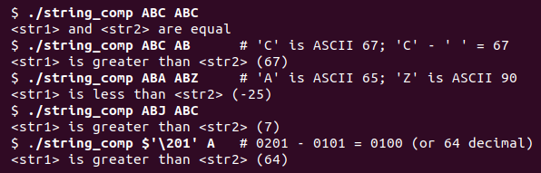

# Resolución de la práctica desglosada


## Ordenación con strcmp



Tal como vemos en la imagen superior, en caso de tener un string ABC(1) y otro ABJ(2) por ejemplo, al comparar ambos con strcmp(<1>, <2>) devolverá un valor negativo, ya que en ASCII, el valor de C es menor que el de J.

Sabiendo esto podemos emplear strcmp en el código haciendo que si la comparación da un valor negativo ("string 1 menor que string 2") deberemos dejar el primer string ordenado por encima del segundo.

Siguiendo este mismo tipo de comparaciones para una lista completamente aleatoria, si comenzamos por el primer string que encontremos y vamos comparando parejas, podemos saber cuando debemos intercambiar un elemento de sitio. 

## Algoritmo de reordenación

1. Comenzamos por el primer elemento de argv[] exceptuando el 0 por ser el nombre del programa
```
argv[i] ---> elemento i
```
2. Recorremos el resto de argumentos posteriores (iteramos de i+1 hasta el final de argv[])
```
for(desde j=i+1 hasta j=argc) : argv[j] ---> elemento j
```
3. Comparamos el elemento del índice inicial con cada uno de los posteriores
```
[dentro del for]:
n = strcmp(elemento i, elemento j)
```
4. En caso de que strcmp devuelva un valor positivo, intercambiamos sus posiciones ---> ELEMENTO I A LA POSICION J Y VICEVERSA
```
if(n > 0) ---> intercambio
```
El intercambio en detalle se haría mediante una variable intermedia tipo char* (para concordancia con el tipado de argv[]), que actuaría de intermediario. Dado que si hacemos argv[ j ] = argv[ i ] perdemos el valor previo de argv[ j ] y duplicamos el de argv[ i ], la solución sería hacer lo siguiente: 
```
char *intermediario_temporal = argv[j];
argv[j] = argv[i];
argv[i] = intermediario_temporal;
```
5. Si se devuelve un valor negativo, pasamos a comparar el siguiente elemento j hasta llegar al final de argv[]

6. En caso de que lleguemos al último elemento, volvemos a comenzar desde i+1, repitiendo hasta haber llegado al valor límite de i

## Pseudocódigo de la solución

Estructurando esos mismos pasos en un pseudocódigo muy arcaico quedaría algo como lo siguiente:
```
int
main(argc, argv[]){
    
    char *intermediario;
    char i, j;

    for(i = 1, i < argc; i++) {
        for(int j = i+1; j < argc; j++) {
            n = strcmp(argv[i], argv[j]);
            if(n>0) { intercambio(); }
        }
    }

    imprimir(argc, argv[]);
}
```

Por otra parte, la función de intercambio podría integrarse aparte o en el mismo main, y tendría la estructura del pseudocódigo que ya aparece en el paso 4. del algoritmo de ordenación explicado anteriormente. 

En cuanto a la impresión de los argumentos, el programa a desarrollar se podría hacer mediante cualquier bucle que vaya iterando por los mismos uno a uno, como un for o un while. Dado que previamente hemos utilizado dos for anidados y para distinguir aún más ambas partes del código, utilizaré un while en esta ocasión, además con una variable de control separada de las dos previas declaradas para los bucles anidados (i, j). Si llamamos a esta nueva variable "print_index", el pseudocódigo de la función imprimir(argv[]) se podría reducir a lo siguiente:
```
void
imprimir(argc, argv[]) {

    int print_index = 1;

    while(print_index < argc) {
        fprintf("%s\n", argv[print_index]);
        print_index++;
    }
}
```

## Programa final desarrollado

Probando el programa por partes y poco a poco para comprobar su correcto funcionamiento, he conseguido implementarlo con las pautas anteriores siguiendo las siguientes fases de desarrollo:

1. Pruebas con la función imprimir desarrollada en el main

Conseguido: imprime todos los argumentos que le introduzcas al programa, separados por saltos de línea y sin fallos

2. Pruebas con el doble bucle for para la ordenación implementado con la comparación y el intercambio

Conseguido: imprime los argumentos igual que anteriormente, esta vez ordenados absolutamente todos
Conseguido: realizando más pruebas vemos que no tiene errores ni frente a caracteres especiales o argumentos duplicados

---

## Modificación para la p1

Debemos cambiar el comportamiento para que, mediante el valor de una variable de entorno denominada DIRECTION imprima los argumentos en orden alfanumerico o inverso al mismo. 

En caso de que la variable de entorno valga forward o no esté definida, se debe tener el funcionamiento normal del programa argsort ya desarrollado

Por el contrario, de tener DIRECTION el valor backward, se escribirán los argumentos en orden inverso

Ya que sabemos como funcinoa strcmp, primero sería conveniente modificar el programa y hacer las pruebas pertinentes para que nos permita ambos modos de impresión al margen de cualquier valor de una variable de entorno. Tomaremos de primera base una modificación equivalente pero dependiendo de una VARIABLE LOCAL denominada de la misma manera que la variable de entorno que se tomará a futuro.

---

## Codigo eliminado de la funcion if_relocate:
```
	// En caso de que (if_forward no valga 0) -> (TRUE), se ordenará alfanumericamente
	if (if_forward) {
		// if que determina si intercambiar posiciones de dos strings : ORDEN DIRECTO
		if(strcmp(arg1, arg2) > 0) {
			return 1;
		} else {
			return 0;
		}
	}
	// por el contrario, si (if_forward vale 0) -> (FALSE), se ordenará de manera inversa
	// if que determina si intercambiar posiciones de dos strings : ORDEN INVERSO
	if(strcmp(arg1, arg2) < 0)  {
		return 1;
	} else {
		return 0;
	}
```